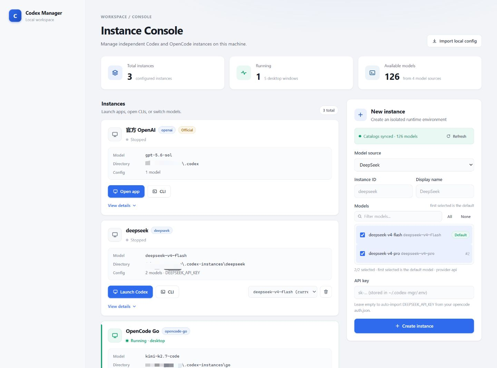

# codex-mgr

`codex-mgr` is a local multi-instance manager for Codex. It creates, starts, stops, and deletes isolated Codex desktop / CLI instances, and connects third-party model services through the OpenCodex proxy.

It is designed for local use and listens on `127.0.0.1` by default.



## Features

- Auto-detects the local Codex CLI, OpenCode CLI, and Codex desktop app
- Imports an existing `~/.codex/config.toml`
- Creates isolated third-party provider instances
- Supports DeepSeek, OpenCode Zen, OpenCode Go, OpenAI, and custom providers
- Built-in / dynamic model catalogs
- Isolated desktop profiles per instance
- Starts / stops desktop apps and CLIs
- Shows real processes, PIDs, start times, and profile usage state
- Centralized API key storage injected by env key
- Records create, start, stop, delete, model-switch, and OpenCodex events
- OpenCodex runs independently in the background and survives panel exits
- Supports background panel start, status query, and stop

## Supported model sources

| Source | Description |
| --- | --- |
| DeepSeek | Probes `https://api.deepseek.com/` `/models` by default; falls back to the built-in catalog on failure |
| OpenCode Zen | Via the local OpenCodex proxy and the built-in catalog |
| OpenCode Go | Via the local OpenCodex proxy and the built-in catalog |
| OpenAI | Uses the Codex CLI built-in model catalog |
| Custom | Provide a provider id, base URL, env key, and optionally an API key |

## Install

Requirements:

- Bun
- Codex CLI
- Codex / ChatGPT desktop app

Install dependencies:

```bash
bun install
```

## Development

```bash
bun run dev
```

The dev server defaults to:

```text
http://127.0.0.1:9810
```

If port 9810 is taken, Vite automatically tries subsequent ports.

## Build

```bash
bun run build
```

## Foreground start

```bash
bun run start
```

Suitable for debugging logs or observing output directly in a terminal.

## Background panel start / stop

Start in the background:

```bash
bun run daemon start
```

Query status:

```bash
bun run daemon status
```

Example output:

```text
running pid=12345 url=http://127.0.0.1:9810
log=C:\Users\<user>\.codex-mgr\panel.log
```

Stop the panel:

```bash
bun run daemon stop
```

`daemon stop` only stops the panel process:

- Does not stop OpenCodex
- Does not stop launched Codex instances
- Does not delete any instance data

## OpenCodex

OpenCodex is the local proxy dependency for OpenCode Zen / Go related instances.

When the panel starts OpenCodex it will:

1. Request `http://127.0.0.1:10100/healthz`
2. Verify the response contains `service === "opencodex"`
3. Adopt the healthy instance if one already exists
4. Otherwise start an independent detached process via Bun

Therefore:

- The panel exiting does not stop OpenCodex
- The panel restarting re-detects the existing OpenCodex
- OpenCodex can keep serving launched instances independently of the panel

Explicitly stop OpenCodex:

```bash
curl -X POST http://127.0.0.1:9810/api/adapters/opencodex/stop
```

## Data directory

### Panel state

```text
~/.codex-mgr/
```

Contains:

| File / directory | Description |
| --- | --- |
| `registry.json` | Instance registry |
| `.env` | API keys |
| `activity.jsonl` | Operation history |
| `panel-state.json` | Background panel PID / port state |
| `panel.log` | Background panel log |
| `logs/` | CLI logs |

### Codex instances

```text
~/.codex-instances/<instance-id>/
```

Each instance contains:

- `config.toml`
- `models.json`
- `.desktop-profile/`
- Local session data
- Config backups

### Official instance

The official instance reuses:

```text
~/.codex
```

No separate instance directory is created for the official instance.

## API keys

Third-party provider API keys are never written into the instance `config.toml`.

The panel stores keys in:

```text
~/.codex-mgr/.env
```

Only the env key name is written into the instance config, for example:

```toml
[model_providers.deepseek]
base_url = "https://api.deepseek.com/"
env_key = "DEEPSEEK_API_KEY"
```

When launching an instance, the panel reads `.env` and injects the matching environment variables.

If multiple instances share the same env key, deleting one instance does not delete the key. It is only cleaned up when no remaining instance references it.

## Deleting instances

Deleting a non-official instance will:

1. Stop the desktop / CLI processes detected for that instance
2. Delete the instance directory
3. Delete local sessions and config backups
4. Delete the API key when no other instance references it

The official instance cannot be deleted because it shares `~/.codex` and the signed-in desktop profile.

## Process state detection

The panel combines two sources of information:

1. Registry records written when this panel launched processes
2. The `--user-data-dir` in desktop process command lines

This guarantees:

- Real desktop processes are still found after a panel restart
- "Running" state and "Stop" actions use the same source of truth
- Isolated profiles never kill each other
- Untracked processes are shown as untracked

## Common APIs

| Method | Path | Description |
| --- | --- | --- |
| `GET` | `/api/status` | Detects CLI, desktop app, and process state |
| `GET` | `/api/instances` | Lists instances with real running state |
| `POST` | `/api/instances` | Creates an instance |
| `DELETE` | `/api/instances/:id` | Deletes an instance |
| `POST` | `/api/instances/:id/launch` | Launches an instance |
| `POST` | `/api/instances/:id/stop` | Stops an instance |
| `POST` | `/api/instances/:id/switch-model` | Switches the current model |
| `GET` | `/api/instances/:id/activity` | Views instance operation history |
| `GET` | `/api/models` | Fetches the model catalog |
| `POST` | `/api/adapters/opencodex/start` | Starts OpenCodex |
| `POST` | `/api/adapters/opencodex/stop` | Stops OpenCodex |

## Project structure

```text
src/
  routes/              Frontend pages
  http/                Hono API
  clone.ts             Instance config generation
  launcher.ts          Desktop app / CLI launcher
  runtime.ts           Instance runtime state resolution
  registry.ts          Instance registry
  activity.ts          Operation history
  opencodex-adapter.ts OpenCodex adapter layer
  models.ts            Model catalogs
scripts/
  start.ts             Foreground start
  daemon.ts            Background start / status / stop
tests/                 Unit tests
```

## Verification

```bash
bun run typecheck
bun test
bun run build
```

## Current limitations

- The panel API has no browser authentication layer; it is recommended to only run it on a trusted local machine
- The official instance shares the desktop profile by default and does not support safe multi-instance launches
- CLI processes started from an external terminal are not guaranteed to be precisely stoppable by the panel
- Windows is the primary verification platform; macOS support still needs real-world testing
